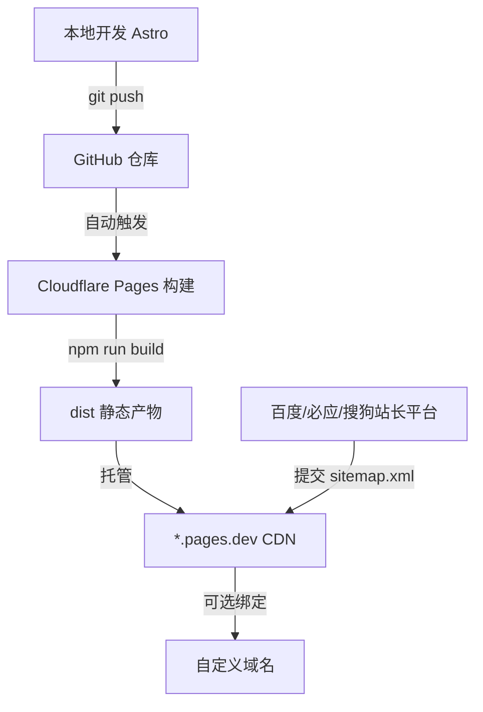

## 产品概述

一个面向国内访问的个人简历/作品集静态网站，在免备案前提下尽可能保证国内访问稳定性与搜索引擎可发现性，部署于 Cloudflare Pages（GitHub 仓库自动构建），未来可平滑升级至独立备案域名。

## 核心功能

- 个人首页：英雄区展示姓名/职位/标语/头像，关于、技能、精选作品预览、联系方式分区呈现
- 作品集列表页：项目卡片网格展示，支持按标签筛选
- 项目详情页：动态路由 `[slug]`，展示封面/描述/技术栈/外链/正文，支持上一篇/下一篇导航
- 全站 SEO：语义化 HTML、独立 title/description/keywords/canonical、OG/Twitter Card、JSON-LD 结构化数据（Person / CreativeWork）
- 自动生成 sitemap.xml 与 robots.txt，并文档化向百度/必应/搜狗/360 站长平台提交流程
- 响应式设计，桌面与移动端适配，暗色模式支持
- GitHub 推送即自动构建部署至 Cloudflare Pages，自动 HTTPS

## 技术栈

- 框架：Astro（静态导出 `output: 'static'`，零 JS 默认输出，SEO 与性能最优）
- 语言：TypeScript
- 样式：Tailwind CSS（JIT 按需生成，自动 purge）
- 交互组件：React（Astro Islands 架构，仅按需 hydrate 主题切换/移动菜单/筛选等）
- 组件库：shadcn/ui（Tailwind 驱动，可访问性好，按需引入）
- SEO 工具：`@astrojs/sitemap`（自动 sitemap）、`astro-seo`（meta 标签管理）、自定义 JSON-LD 注入
- 部署：Cloudflare Pages 连接 GitHub 仓库，构建命令 `npm run build`，输出目录 `dist`

## 实现方案

采用 Astro 静态站点生成器构建预渲染站点，所有页面在构建时生成纯 HTML，默认不向客户端发送 JS（仅交互岛按需 hydrate），最大化 LCP 性能与 SEO 友好度。内容数据集中在 `src/data/projects.ts` 管理，项目详情通过 `getStaticPaths` 预生成静态页面。部署链路为：本地 `git push` → GitHub 仓库 → Cloudflare Pages 自动拉取构建 → 输出 `dist` 托管于 `*.pages.dev`（免备案、自动 HTTPS）。

### 关键技术决策

- **Astro 静态导出 vs SPA**：静态 HTML 对百度/必应爬虫最友好，无需 SSR 服务器成本，与 Cloudflare Pages 静态托管天然匹配。
- **React Islands 最小化**：仅在主题切换、移动端菜单、项目筛选等需要客户端状态的场景引入 React 组件并指定 `client:load`/`client:visible`，其余保持纯 HTML，控制 JS 体积。
- **Cloudflare Pages vs 国内方案**：用户明确免备案，Cloudflare Pages 免费、自动 HTTPS、GitHub 集成零配置；代价是国内访问速度波动、百度收录权重低于备案独立域名——通过完整站内 SEO + 主动推送弥补。
- **保留升级路径**：站点 URL 与 canonical 统一通过 `src/consts.ts` 的 `site` 字段管理，未来切换独立域名仅需改一处配置 + Cloudflare 绑定自定义域名，无需重构。

### 性能与可靠性

- 静态预渲染：构建时生成全部 HTML，LCP 接近即时（TTFB 仅 CDN 延迟），无运行时计算瓶颈。
- 图片优化：使用 Astro `<Image>` 组件自动生成 WebP/AVIF 多尺寸响应式图片，减少首屏载荷。
- CSS：Tailwind purge 后通常 < 20KB；JS 仅交互岛（估 < 30KB gzipped）。
- 瓶颈：Cloudflare CDN 国内延迟波动（200-800ms），无法完全消除；通过预渲染 + 资源压缩 + 缓存头缓解。

## 实现说明

- `astro.config.mjs` 中必须设置 `site` 字段为最终线上 URL（如 `https://xxx.pages.dev`），否则 sitemap 与 canonical URL 不正确。
- Cloudflare Pages 通过控制台连接 GitHub 仓库（非 GitHub Actions），设置 Framework preset = Astro 或自定义 Build command = `npm run build`、Output = `dist`。
- 默认 `*.pages.dev` 域名可免备案访问；绑定自定义域名时需将域名 DNS 托管至 Cloudflare，无需备案但国内速度提升有限。
- 图片放置 `public/images/` 下，通过 `<Image>` 引用；OG 默认图 `public/og-default.png` 尺寸建议 1200×630。
- 暗色模式用 `class` 策略 + `localStorage` 持久化，注意防闪烁（head 内联脚本设置初始 class）。
- Windows/cmd 环境：`npm` 命令兼容，路径用正斜杠。

## 架构设计



### 模块划分

- **布局层**（`layouts/BaseLayout.astro`）：HTML 骨架、SEO head 注入、Header/Footer 挂载
- **SEO 组件**（`components/SEO.astro`）：可复用 meta/OG/JSON-LD 注入，接收 title/description/image 参数
- **页面层**（`pages/`）：首页、作品集列表、项目详情（动态路由）、404
- **数据层**（`data/projects.ts`、`consts.ts`）：站点配置与项目内容集中管理
- **UI 组件层**（`components/`）：Header、Footer、ProjectCard、SkillBadge 等

### 数据流

内容数据（`data/projects.ts`）→ `getStaticPaths` 预生成项目详情页 → 构建时注入 SEO head → 输出静态 HTML → Cloudflare CDN 分发 → 搜索引擎爬取 sitemap 收录

## 目录结构

全新项目，工作目录 `f:\毕业重要文件\pages` 当前为空。

```
pages/
├── astro.config.mjs              # [NEW] Astro 配置：集成 sitemap/tailwind/react，设置 site URL
├── package.json                  # [NEW] 依赖：astro, @astrojs/sitemap, @astrojs/tailwind, @astrojs/react, astro-seo, tailwindcss, shadcn 相关
├── tsconfig.json                 # [NEW] TypeScript 配置，extend astro/tsconfigs/strict
├── tailwind.config.mjs           # [NEW] Tailwind 配置：设计令牌、暗色模式 class 策略、shadcn 主题变量
├── README.md                     # [NEW] 本地开发/构建/部署(Cloudflare Pages)/SEO 提交/升级独立域名 全流程文档
├── public/
│   ├── robots.txt                # [NEW] 允许全部爬虫，声明 Sitemap 地址
│   ├── favicon.svg               # [NEW] 站点图标
│   ├── og-default.png            # [NEW] 默认 OG 分享图 1200×630
│   └── images/                   # [NEW] 头像、项目封面缩略图
├── src/
│   ├── consts.ts                 # [NEW] 站点常量：name, title, description, site URL, email, social 链接
│   ├── data/
│   │   └── projects.ts           # [NEW] 项目数据数组：slug/title/description/tags/cover/links/content/featured/date
│   ├── components/
│   │   ├── SEO.astro             # [NEW] 可复用 SEO head：meta/OG/Twitter Card/canonical/JSON-LD 注入
│   │   ├── Header.astro          # [NEW] 顶部导航栏（React Island 主题切换 + 移动菜单）
│   │   ├── Footer.astro          # [NEW] 页脚：版权、社交链接、备案占位
│   │   ├── ProjectCard.astro     # [NEW] 作品集卡片：封面/标题/描述/标签
│   │   └── SkillBadge.astro      # [NEW] 技能标签徽章
│   ├── layouts/
│   │   └── BaseLayout.astro      # [NEW] 基础布局：HTML 骨架 + SEO + Header + slot + Footer + 防闪烁脚本
│   ├── pages/
│   │   ├── index.astro           # [NEW] 首页：Hero/About/Skills/Featured Projects/Contact
│   │   ├── projects.astro        # [NEW] 作品集列表页：标签筛选(React Island) + 项目网格
│   │   ├── projects/
│   │   │   └── [slug].astro      # [NEW] 项目详情页：getStaticPaths 预生成，含上下篇导航
│   │   └── 404.astro             # [NEW] 自定义 404 页面
│   └── styles/
│       └── global.css            # [NEW] 全局样式：Tailwind 指令、shadcn CSS 变量、自定义工具类、滚动动画
```

## 关键代码结构

```typescript
// src/data/projects.ts — 项目数据接口，跨列表页与详情页共享
export interface Project {
  slug: string;
  title: string;
  description: string;
  tags: string[];
  cover: string;           // public/images 下的相对路径
  links: { demo?: string; repo?: string };
  content: string;         // Markdown 正文
  featured?: boolean;
  date: string;            // ISO 日期，用于排序与 JSON-LD datePublished
}
export const projects: Project[] = [ /* ... */ ];
```

```typescript
// src/consts.ts — 站点级配置，canonical/sitemap/SEO 统一引用
export const SITE = {
  name: '你的名字',
  title: '你的名字 · 个人简历与作品集',
  description: '前端开发工程师，专注 Web 应用与用户体验设计',
  site: 'https://your-name.pages.dev',  // 部署后替换为实际 *.pages.dev 或自定义域名
  email: 'you@example.com',
  social: { github: 'https://github.com/xxx', wechat: 'xxx_id' },
} as const;
```

## 设计风格

采用现代极简主义融合玻璃拟态点缀，打造专业且具个人气质的简历作品集站点。以 Astro 生成静态 HTML 为骨架，React Islands 承载交互（主题切换/移动菜单/筛选），shadcn/ui 组件保证可访问性与一致性，Tailwind CSS 驱动全部样式。整体大面积留白、柔和阴影、微妙渐变与入场动画，传递高级感与科技感。

### 页面规划（3 页）

**首页 index**

- 顶部导航栏：左侧 Logo/姓名，中间导航链接（首页/作品集/联系），右侧暗色模式切换按钮，移动端折叠为汉堡菜单
- 英雄区：左侧大号姓名+职位+一句话标语+两个 CTA（查看作品/联系我），右侧头像卡片带玻璃拟态光晕背景，入场淡入上移动画
- 关于区：左右分栏，左侧个人简介段落，右侧高亮数据卡片（年限/项目数/技术栈数）
- 技能区：按分类分组的技能徽章网格，hover 时微缩放与渐变边框
- 精选作品区：3 张 featured 项目卡片横向排列，hover 抬升+阴影加深+图片缩放
- 联系区：邮箱+社交链接卡片，玻璃拟态背景，图标 hover 高亮
- 页脚：版权信息、快速链接、ICP 备案占位文本

**作品集列表页 projects**

- 顶部导航栏（与首页一致）
- 页面头：大标题"作品集"+副标题描述
- 筛选栏：标签按钮组（React Island，点击筛选项目，选中态渐变填充）
- 项目网格：响应式卡片网格，每张含封面图+标题+描述+标签+外链图标，hover 整卡抬升
- 页脚（与首页一致）

**项目详情页 projects/[slug]**

- 顶部导航栏（与首页一致）
- 项目头：返回链接+标题+标签+外部链接按钮（Demo/Repo）
- 封面大图：全宽圆角卡片，渐变遮罩
- 正文区：左侧主内容（描述/功能特性/技术栈），右侧粘性目录卡片
- 上下篇导航：底部两栏卡片，hover 渐变背景
- 页脚（与首页一致）

## Agent Extensions

### Skill

- **多模态内容生成**
- Purpose: 为个人站点生成视觉素材，包括专业头像/英雄区插画、项目封面缩略图、默认 OG 分享图
- Expected outcome: 生成一组风格统一的站点视觉素材（头像 1 张、英雄区装饰图 1 张、项目封面 3 张、OG 图 1 张），放入 `public/images/` 供页面引用，使站点首屏视觉完整且具个人品牌辨识度